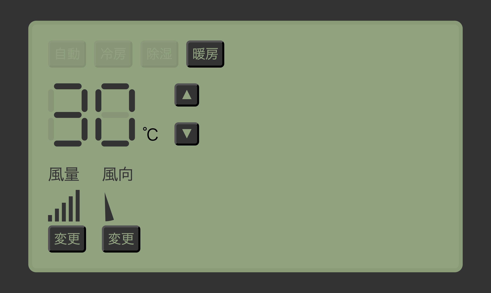

- [@lazarv/react-server](https://react-server.dev/)
- [Nature Remo](https://nature.global/)

# Usage

1. `pnpm install`
1. Issue your access token at [Nature Home](https://home.nature.global/)
1. `API_KEY='ory_at_your.key' pnpm dev`
